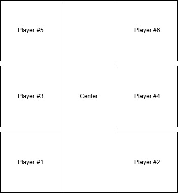

# 游戏策划案

初步计划将THUAI8中个人提出的弃用方案复活: 即基于塔防玩法的中间出怪两边防守. 
当然对于做成游戏而非竞赛后端的程序, 并不需要追求两边的对战. 粗略的概述:

游戏可以单人或者多人游玩, 但无论几人游玩, 玩家的主要任务都是建设并保护基地免受来自于
地图中出怪点的怪物的攻击. 玩家的最终目的是取得更高的积分, 建设更繁华的基地, 坚持更长
时间,击败更强力的怪物等均可以获得更高的积分.

和传统式塔防不同的是, 玩家不需要对每一个防御塔等要素如何布置做细致的规划, 而是提供一系列
工具对建筑做粗略的功能分类. 这一点可以参考Cities: Skyline中对于功能区的划分. 比如在地
图的某一部分建设生产区, 另一部分建设防守区/进攻区等, 划分完区域后你的基地会自动消耗已有
资源进行相应的建设.

下面是稍微具体的游戏要素介绍, 尚待补全:
### 地图
地图分为玩家控制区和中心出怪区. 玩家控制区为一个正方形, 正方形的其中一条边与中心出怪区
邻接. 中心出怪区大致为长条形矩形, 其宽度一定, 长度视玩家数量而定, 玩家控制区只会与
中心区的长边邻接. 无论区域, 地图被划分为很多小格子.

### 格子
格子: 地图的格子具有一定属性, 如:
- 建设难度
- 通过难度
- 类型: 一般陆路/水路/高山
- 资源
- 在格子上建设的建筑
- ......

玩家可以在格子之上进行各种建筑(本质上是为格子附加建筑属性), 敌我方可移动单位在行进时也
以格子为单位进行行动(也即不会出现小数坐标的移动单位).

格子是本游戏的核心, 所有游戏要素都与格子直接进行互动. (如, 攻击性建筑的攻击本质上是其
附近的格子的敌方会受到秒伤) // 这里只是对可能的实现方式做了一些设想, 最终可能不是这样.

### 选区
玩家可以在格子上划分选区, 系统会自动根据选区来建设建筑, 选区本身不会直接为格子附加效果.

### 建筑
建筑是格子属性之一, 建筑可以占据单格或多格, 单格上也可以有多个建筑, 但建筑的叠加可能会
受到建筑本身限制的影响.

建筑具有血量, 建筑血量归零后其将从所在的格子的属性中消失, 等效于建筑摧毁. 建筑可能对所
在格子及其周边附加效果, 如Buff/Debuff/伤害等.

### 可移动单位
类似于建筑, 但是可以移动.

### 基地核心
在玩家控制区远离中心区的一侧, 是特殊的建筑, 玩家无法主动拆毁. 其具有较高血量, 其被摧毁
时玩家退场. 核心还有很多其他作用, 但是待定...

### 资源
属于玩家而非格子的数值属性. ~~积分怎么不算资源呢~~

## 游戏背景和故事
...尚待补全
